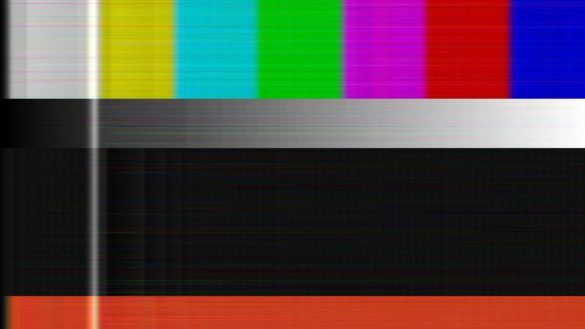

# slope

> **AI-assisted project.** This codebase was created with [Claude](https://claude.com/claude-code)
> (Anthropic), directed and reviewed by a human author. The coder is not
> asserted but measured: an offline harness drives the real plugin class in a
> headless GL context and reads each claim back out of the picture it made —
> a step edge of height h climbs in exactly ⌈h/Δ⌉ samples, at whole-sample and
> part-sample edge positions; a flat field's idle pattern has period two and a
> peak-to-peak of one step, sample for sample; on a run of bits the step grows
> by the stated syllabic law; a forced bit error fades on the integrator's time
> constant, fitted to 64.00 and 256.0 samples; every pixel of noise through
> the GPU matches a serial double-precision run of the same recurrence, with a
> tolerance of **zero** in the settings where float arithmetic is exact; a
> vertical scan is the horizontal one transposed, bit for bit — with nine
> negative controls that prove each check can fail. It has **never been loaded
> into Resolume**. It is loaded by [oxbow](https://github.com/stoatworks-labs/oxbow),
> which is a real FFGL host and is not Resolume. See [Status](#status).

A one-bit delta modulator run along the scan line, as an FFGL effect for
[Resolume](https://resolume.com) Arena and Avenue.



<sub>One frame, rendered by `sltest`, the offline harness — not captured from
Resolume. RGB, two pixels a sample, a 1/64 step adapting to 1/8, and one
received bit in a thousand flipped. Every streak is one wrong bit, fading on
the integrator's leak.</sub>

## The one idea

A delta modulator sends **one bit per sample**: is the input above or below my
current guess? The decoder has only the same guess, stepped up or down by one
step per bit. CVSD — continuously variable slope delta, the codec of military
and Bluetooth voice — adapts that step: a run of identical bits means the guess
is falling behind, so the step grows; alternating bits mean it is hunting round
a flat input, so the step shrinks back. Both integrators leak, so a transmission
error dies away.

Run it along each scan line of the picture, one sample per few pixels, and
every artefact falls out of that one rule. None of these is drawn:

- **Slope overload.** The guess can climb one step a sample, so a hard edge
  arrives as a ramp smeared along the scan. Its length is h/Δ samples for a
  step of height h — measured, exactly.
- **Granular noise.** On a flat area the bits alternate and the guess hunts one
  step around the true level: a fine two-sample dither wherever the picture is
  smooth.
- **The trade-off.** Adaptation shortens the overload and lengthens the hunt
  after the edge, because the step it grew to takes time to shrink back.
  Adaptation Rate moves the balance, and no setting removes both.
- **Bit errors** throw the decoder's guess for the rest of the line, fading on
  the leak's time constant: streaks that fade rightwards.

The decoder is the real one: the reconstructed staircase goes through the
decoder's low-pass reconstruction filter, which is a control, not a separate
blur. Every scan line starts its coder from the blanking level, so the left
margin of every line is itself an edge, climbing.

## Controls

| Group | | |
| --- | --- | --- |
| **Coder** | Step Size | the smallest step, one 8-bit code to sixteen; 1/64 by default |
| | Max Step | how far adaptation may grow it, up to the whole range; 1/8 by default |
| | Adaptation Rate | what a run of identical bits adds to the step; 0 is a fixed step |
| | Run Length | the run detector's window, 3 or 4 bits |
| | Leak | the integrator's time constant in samples, 4096 down to 4; 0 is no leak at all |
| **Sampling** | Pixels/Sample | 1 to 16 pixels box-averaged into one sample |
| | Scan | Horizontal (along the rows) or Vertical (down the columns) |
| | Channels | Luma (colour carried through uncoded), RGB (three coders), Y+C (chroma at half rate) |
| **Channel** | Bit Errors | the fraction of received bits flipped, one in a hundred thousand to one in ten |
| **Decoder** | Reconstruction | the decoder's low-pass, 63 samples down to none |
| | Show Bits | the received bitstream as black and white, one primary per coder |
| **Output** | Mix | |

## Status

**v0.1.0, local and unreleased, 2026-09-24.** Built from the fleet's templates
in one session. What `tools/verify.sh` establishes on this Mac (Apple M4 Max,
macOS 26.4.1), on a fresh universal build, at **320×180 and 1280×720**:

| check | what it establishes |
| --- | --- |
| `--overload` | a step of 8.5, 13.5 and 27.5 steps climbs in 9, 14 and 28 samples from the predicted sample, at one and four pixels a sample and at every fractional edge position, and the staircase is exact; 15 cases |
| `--granular` | with no leak, a flat field at 0.25, 0.5 and 0.75 IS the idle pattern from the lock sample on — period two, one step peak-to-peak — with zero error over 2,448–10,112 samples; with a 64-sample leak the pattern converges on ±Δ/(1+β) as stated |
| `--adapt` | every step of an 11-bit run is β_s × the previous + Δ_add, recovered from the picture to 0.000 of tolerance; a 0.3 edge takes 20 samples with a fixed step and 4 adapting, both predicted exactly |
| `--tradeoff` | over Adaptation Rate 0, 1/8, 1/4, 1/2, 1 the climb goes 23, 16, 12, 10, 7 samples and the post-edge energy 0.0047 → 0.0204, rising at every step |
| `--leak` | a forced bit error moves the guess 2Δ and fades on β^k, worst 0.03 of tolerance; fitted 64.02 and 256.0 samples against 64 and 256 |
| `--reference` | 8.3 M values per setting at 720p, in two exact settings **worst 0** (tolerance 0); in three settings with leaks, filter, adaptation, errors, Y+C and a vertical scan, worst 0.06 of a per-operation float bound |
| `--vertical` | 3.7 M values, 0 differ |
| `--errors` | 27,616 and 27,627 of 2,764,800 bits flipped against 27,648 ± 662; the two frames' flips differ in 54,685 positions against 54,743 ± 936 |
| `--negative` | nine perturbed coders — 1.25 steps a bit, a leak toward black, the run detector removed (twice), a decoder that does not leak, the spec's windowed restart, chroma at full rate, an upward vertical scan, half the error rate — each **fails** its check |
| mutation | one character of the shipped GLSL (the comparator's tie, `>=` → `>`) was caught by `--granular`, `--reference` and `--errors` at both rasters, then reverted |
| `tools/sweep.py` | all **12** controls measurably change the picture |
| shaders | all 4, as the plugin compiles them, through `glslc` |
| `--pipe` | 2.5 frames in, exactly 2 out; an unknown cue refused (2); a failed render and a closed stdout (`\| head -c 1`) each exit 1 |
| the bundle | universal (`x86_64 arm64`), exports `plugMain`, ad-hoc signs; `oxbow` reports `SW Slope` / `SL01` / `effect` and renders 120 frames through `plugMain` |

Render cost at the defaults, best of three runs of 60 frames after a warm-up,
`glFinish` both sides, on a GPU shared with other builds: **0.60 ms** at 720p,
**1.21 ms** at 1080p, **2.89 ms** at 4K; with three coders at one pixel a
sample, 1.41 / 2.73 / 7.84 ms. One draw call per 32 samples of the scan is
where the time goes. macOS figures only.

### Not established

It has **never been loaded into Resolume on macOS**. Everything above was
compiled, rendered and measured offline against the real plugin class in a
headless CGL context, plus an `oxbow` load. Footage has only been seen
through the harness's `--pipe` (Resolume's bundled demo clips, for the
release video): that is where the Y+C chroma start was found and fixed, and
it is what confirmed the defaults survive the library without flooding any
clip. How twelve controls read in Arena's inspector on macOS is untested.
No OpenFX port. The [browser demo](https://slope-demo.stoatworks-labs.com/)
runs the plugin's own shaders in the plugin's own chunks; its draw schedule and
control laws are a hand port to JavaScript, and nothing checks a port but a
reader. There is a [user guide](https://stoatworks-labs.com/software/slope/guide/).

## Build

Needs CMake 3.15+, a C++17 compiler, and the FFGL SDK submodule.

```bash
git clone --recursive https://github.com/stoatworks-labs/slope
cd slope
cmake -B build -DCMAKE_BUILD_TYPE=Release
cmake --build build --parallel
cmake --install build     # into ~/Documents/Resolume Arena/Extra Effects
```

macOS builds are universal (Apple Silicon + Intel) by default; add
`-DCMAKE_OSX_ARCHITECTURES=arm64` for a faster dev build. Windows needs GLEW via vcpkg.

## Building and testing

The offline harness renders the real plugin class headlessly:

```bash
./build/sltest --out /tmp/frame.png --size 1920x1080   # the moving card
./build/sltest --list                                  # every control, kind and default
./build/sltest --overload --granular --adapt --tradeoff --leak   # each claim, measured
./build/sltest --reference --vertical --errors
./build/sltest --negative                              # and the checks can fail
./build/sltest --offline                               # what needs no GL (CI)
./build/sltest --bench                                 # 720p, 1080p and 4K
python3 tools/sweep.py                                 # no control is silently dead
tools/verify.sh                                        # all of it, on a fresh universal build
```

Every check takes `--size`; run it at 320×180 as well as the raster you care about.
Footage goes through the real shaders with `--pipe`, in the fleet's frame format:

```bash
ffmpeg -i in.mov -f rawvideo -pix_fmt rgba - \
  | ./build/sltest --pipe --size 1920x1080 --script cues.txt \
  | ffmpeg -f rawvideo -pix_fmt rgba -s 1920x1080 -r 50 -i - out.mov
```

See [`CLAUDE.md`](CLAUDE.md) for the full command reference and
[`AGENTS.md`](AGENTS.md) for the model and the traps.

## Browser demo

[slope-demo.stoatworks-labs.com](https://slope-demo.stoatworks-labs.com/) runs
the plugin's own sample, coder and display shaders in WebGL2, on generated clips,
with every control the plugin declares. The coder *is* the shader, so what you
see is the recurrence the plugin runs; `demo/tools/check_shaders.py` fails
`tools/verify.sh` if the page's copy of any shader drifts from `source/Shaders.cpp`.
The draw schedule (one draw per chunk of 32 samples, ping-ponging two
two-attachment state buffers) and the control laws are a hand port of
`Slope.cpp`, `StateBuffer.cpp` and `Controls.cpp`, and nothing checks that but a
reader. It is not the plugin: no Resolume, no FFGL, GLSL ES 3.00 rather than GL
4.1, and Pixels/Sample is a dropdown because the page has no integer control.
The page says all of this itself. Source in [`demo/`](demo/).

<!-- attributions:start -->
This project is built on other people's work — see [ATTRIBUTIONS.md](ATTRIBUTIONS.md).
<!-- attributions:end -->

## Licence

MIT — see [LICENSE](LICENSE).
